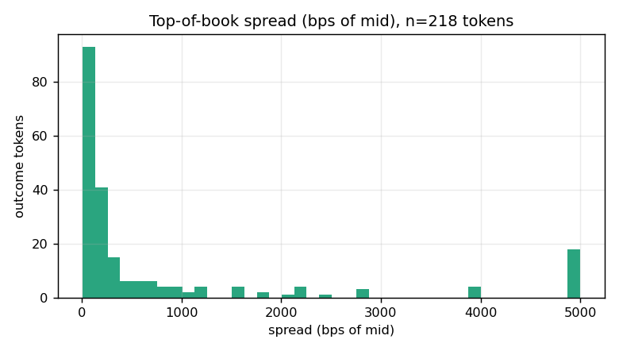
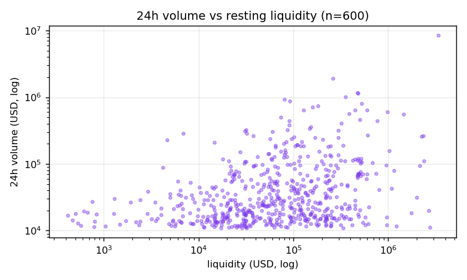

# Polymarket Market Microstructure — Empirical Analysis

> Part of the [Polymarket Research Corpus](./README.md). **Every number below is computed by
> [`analyze.py`](../../../tools/polymarket-research/analyze.py) from the live snapshot
> (2026-07-22 14:42 UTC) and stored in `data/stats.json`.** Sample: 600 order-book markets,
> 140 markets with full L2 books = **218 outcome-token books**.

---

## 1. The market universe at a glance

| Metric (per market)        | median     | mean       | p95         | max          | Σ (sample)     |
|----------------------------|-----------:|-----------:|------------:|-------------:|---------------:|
| 24h volume (USD)           | 25,683     | 87,683     | 286,160     | 8,410,845    | 52,609,744     |
| Lifetime volume (USD)      | 148,668    | 2,273,925  | 13,548,846  | 52,292,580   | 1,364,355,263  |
| Resting liquidity (USD)    | 68,022     | 173,509    | 538,444     | 3,345,439    | 104,105,477    |

**Reading it:** the distribution is *extremely* heavy-tailed. Mean 24h volume ($87.7k) is
**3.4×** the median ($25.7k); lifetime volume mean ($2.27M) is **15×** the median ($149k). A
handful of flagship markets carry most of the flow — the classic prediction-market
**power-law**. Capacity planning, caching, and rate-limit budgets must be sized for the tail,
not the median.

> **Parity implication:** a naive "cache everything equally" strategy wastes memory on the
> long tail and under-serves the head. Tier caching by 24h volume (hot/warm/cold). MarketPips
> `015-PERFORMANCE-CACHING` should key TTLs off `volume24hr` buckets.

---

## 2. Bid–ask spreads

Computed from live top-of-book across 218 outcome tokens:

| Spread metric            | min   | p25   | median | mean   | p75   | p95    | max   |
|--------------------------|------:|------:|-------:|-------:|------:|-------:|------:|
| Absolute (price units)   | 0.001 | 0.001 | 0.002  | 0.0057 | 0.010 | 0.014  | 0.040 |
| As **bps of mid**        | —     | —     | 175.5  | 993.6  | 708.1 | 6,666.7| —     |

**Findings**
1. **Absolute spreads are tiny.** Median **0.2¢** (0.002), and p25 sits at the **minimum tick**
   (0.001) — i.e. a large share of liquid markets are quoted **one tick wide**, as tight as a
   CLOB physically allows.
2. **Relative (bps) spreads explode for longshots.** A 0.2¢ spread on a $0.02 longshot is
   1,000 bps; the same 0.2¢ on a $0.50 coin-flip is 40 bps. Hence median 175 bps but p95
   6,667 bps. **Spread-as-%-of-price is dominated by price level, not by liquidity quality.**
3. The right metric for execution cost on a *specific* trade is **absolute spread + walk-the-book
   slippage**, not bps-of-mid. Use bps only for cross-sectional liquidity ranking within a
   comparable price band.

> **Parity implication:** never surface "spread %" as a headline liquidity score without
> conditioning on price. MarketPips should display absolute spread + depth, and reserve bps
> for internal ranking within price deciles.

---

## 3. Order-book depth & shape

| Depth metric                        | min   | median | mean     | p95        | max         |
|-------------------------------------|------:|-------:|---------:|-----------:|------------:|
| Levels per token (bids+asks)        | 37    | **93** | 108      | 221        | 353         |
| Notional depth within 5¢ of mid (USD)| —    | 38,813 | 726,847  | 5,918,576  | 11,103,708  |
| Book imbalance (bid−ask)/(bid+ask)  | −0.95 | **0.00** | −0.0002| —          | +0.95       |

**Findings**
1. **Books are genuinely deep** — a median of **93 price levels** per outcome token. This is
   not a thin toy book; it is a mature, market-maker-populated CLOB.
2. **Depth is heavy-tailed like volume.** Median 5¢-depth is ~$39k but the mean is ~$727k and
   p95 ~$5.9M — flagship markets hold millions in near-touch liquidity (e.g. *"Will Trump be
   in the WC Champions Photo?"* carried **$7.73M** within 5¢).
3. **Imbalance is symmetric** (median exactly 0.0, mean ≈ 0). At the cross-section, resting
   bid and ask notional are balanced — consistent with two-sided market-making and the
   no-arbitrage duality between YES and NO books.

**Most-liquid markets in the snapshot (by 5¢ notional depth):**

| Market                                             | mid    | spread | depth ≤5¢ (USD) |
|----------------------------------------------------|-------:|-------:|----------------:|
| Will Trump be in the WC Champions Photo?           | 0.9985 | 0.001  | 7,730,649       |
| CS: Team Falcons vs 100 Thieves (BO3)              | 0.855  | 0.010  | 684,427         |
| Athletics vs. Arizona Diamondbacks                 | 0.455  | 0.010  | 319,979         |
| Will Lamine Yamal win the 2026 Ballon d'Or?        | 0.2685 | 0.001  | 313,737         |
| No change in Fed rates after next meeting          | 0.7505 | 0.001  | 275,180         |

---

## 4. The price lattice (tick size)

| Tick size | markets | share  | typical market class                         |
|-----------|--------:|-------:|----------------------------------------------|
| 0.001 (0.1¢) | 388  | 64.7%  | politics, macro, high-liquidity flagships    |
| 0.01  (1¢)   | 212  | 35.3%  | sports, event, lower-liquidity               |

Tick size sets the **minimum possible spread** and the resolution of every quote. Because
64.7% of markets quote to 0.1¢, price and P&L math must carry **≥3 decimal places**; truncating
to cents corrupts the majority of the universe. Min order size is **$5** (median) — a dust
floor that keeps books clean.

---

## 5. Volume ↔ liquidity relationship

On a log–log scatter, 24h volume and resting liquidity are **positively but loosely** coupled:
liquid markets tend to trade more, but the cloud is wide — some deep books trade little
(resolved-but-open, or one-sided consensus like the 0.9985 example) and some thin books churn
(fast-moving sports). **Liquidity ≠ activity.** Both must be tracked independently; neither is
a proxy for the other.

---

## 6. Methodology & reproducibility

- **Source:** `GET /markets` (Gamma, ordered by `volume24hr` desc, `enableOrderBook=true`) +
  `GET /book|midpoint|spread` (CLOB) per outcome token.
- **Spread** = best_ask − best_bid from the live L2 book; **mid** = midpoint of touch.
- **Depth ≤5¢** = Σ(price × size) for all levels within 5¢ of the touch, both sides.
- **Imbalance** = (Σbid_size − Σask_size)/(Σbid_size + Σask_size).
- Percentiles via `numpy.percentile` (linear interpolation). Prices/sizes parsed as decimals.
- Re-run: `python collect.py && python analyze.py`. Results are deterministic per snapshot;
  absolute values drift with the live market between snapshots.
