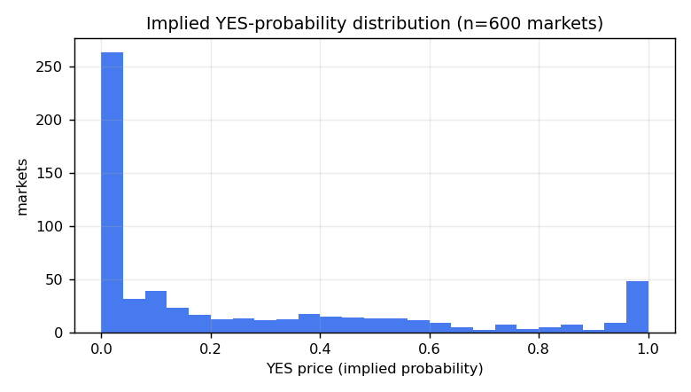
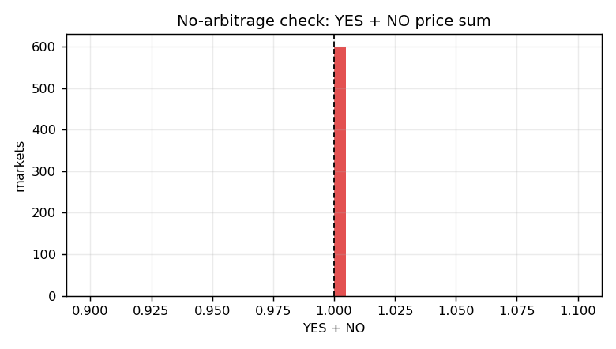

# Polymarket Quantitative Processing — Prices, Probabilities & Risk

> Part of the [Polymarket Research Corpus](./README.md). This is the **quantitative ("quant")
> processing** layer: how to turn raw book/price data into probabilities, no-arbitrage checks,
> execution cost, and risk metrics. All figures from the live snapshot (2026-07-22 14:42 UTC),
> `data/stats.json`.
>
> *Scope note:* "quantum processing" is interpreted here as rigorous **quantitative** data
> processing. Prediction markets involve no quantum-computing component; if literal quantum
> methods were intended, flag it and this doc will be extended.

---

## 1. Price is probability (and how to clean it)

A share redeems for $1 iff its outcome occurs, so **price ≡ risk-neutral implied probability**.
Processing pipeline for any raw price `p`:

1. **Parse as decimal** (never float-ingest the string quotes — rounding bias).
2. **Clamp** to the tradable lattice `[tick, 1 − tick]`; Polymarket never quotes exactly 0/1.
3. **De-vig / normalize** for multi-outcome baskets so `Σ pᵢ = 1` (see §3).
4. **Choose the price estimator** deliberately:
   - `lastTradePrice` — noisy, stale between trades.
   - **`midpoint`** — best default for a fair-value probability (used throughout this corpus).
   - `bestBid`/`bestAsk` — for *executable* (not fair) probability.

---

## 2. The implied-probability distribution (favorite–longshot structure)



YES-price distribution across 600 markets:

| stat | min    | p25    | median | mean   | p75    | p95    | max    |
|------|-------:|-------:|-------:|-------:|-------:|-------:|-------:|
| YES  | 0.0005 | 0.0035 | 0.085  | 0.2529 | 0.4263 | 0.9995 | 0.9995 |

20-bin histogram (0→1): `[278, 36, 36, 22, 15, 20, 10, 20, 18, 17, 15, 16, 10, 6, 6, 4, 6, 7, 7, 51]`

**Findings**
1. **Massive longshot mass.** 278 / 600 markets (**46%**) price YES in **[0.00, 0.05]**. This is
   structural: multi-outcome events (50.17% of the universe is `negRisk`) decompose into many
   low-probability legs (one favorite + many longshots). The median YES price is just **0.085**.
2. **A favorite bump at the top.** 51 markets sit in **[0.95, 1.00]** — the "YES" legs of
   near-decided questions and the complements of those longshots.
3. **The mean (0.253) ≫ median (0.085)** — the distribution is right-skewed by the favorite bump.

> **Why it matters for a parity build:** UI, ranking, and numeric precision must be optimized
> for the **[0, 0.10] band**, where nearly half the tradable universe lives. A cents-only price
> display collapses this entire band into "1¢–10¢" — unusable. Carry 0.1¢ precision (tick=0.001).

### 2.1 Favorite–longshot bias (FLB) note

Classic betting markets exhibit FLB: longshots are systematically **over**-priced relative to
true frequency. Confirming FLB rigorously requires **resolved-outcome** calibration data
(price vs realized win-rate), which needs a historical resolved sample — a documented
follow-up (see §7). The live snapshot establishes the *prior*: the universe is longshot-dense,
so any calibration study must bucket finely below 0.10.

---

## 3. No-arbitrage: the dual-leg coherence check



For a binary market, `P(YES) + P(NO)` must equal 1 (ignoring fees). We tested both data sources:

| Source                         | within 1% of 1.0 |
|--------------------------------|-----------------:|
| Gamma `outcomePrices`          | **100.0%**       |
| Independent CLOB book midpoints| **97.25%**       |

- Gamma is internally consistent by construction (100%).
- Computing the sum from **two independently-fetched token books** still yields 97.25%
  coherence; the ~2.75% residual is **quote latency** between the two `/book` calls, not
  exploitable arbitrage. This is a strong integrity signal: the live CLOB is tightly
  arbitraged across complementary tokens.

**Processing rule:** treat `|P(YES)+P(NO) − 1| > tick` as a **data-quality alarm** (stale
book, one side crossed, or ingestion bug) — not a trading signal. In a parity system this is a
cheap, high-value invariant to assert in the ingestion pipeline and in tests.

For **multi-outcome negRisk** baskets the invariant generalizes to `Σ P(YESᵢ) = 1` across the
mutually-exclusive outcomes; the Neg Risk Adapter enforces the economic version on-chain
(a NO on one outcome ≡ a YES on the union of the others). See
[05-RESOLUTION-CTF-NEGRISK](./05-RESOLUTION-CTF-NEGRISK.md).

---

## 4. Execution cost: walking the book

Absolute spread (median 0.002) is only the *first* tick of cost. Real execution cost for size
`Q` is the **volume-weighted walk** across levels:

```
effective_price(Q) = Σ(level_price × min(remaining, level_size)) / Q      # consume asks (buy)
slippage(Q)        = effective_price(Q) − mid
```

Given median 5¢-depth of **$38,813** and p95 of **$5.9M**, execution cost is trivial for retail
size on flagship markets but material on tail markets. A parity order-preview must compute
`effective_price(Q)` from the live book, **not** quote the touch. Depth-aware previews are the
difference between a toy and a credible trading surface (MarketPips `clob_orders` + a preview RPC).

---

## 5. Volatility / price dynamics

From 140 one-day price-history series (`interval=1d, fidelity=10`):

| metric                          | median | mean   | p95    | max    |
|---------------------------------|-------:|-------:|-------:|-------:|
| Intra-day step σ (Δprice/10min) | 0.0037 | 0.0113 | 0.0428 | 0.0738 |
| Intra-day range (max−min)       | 0.0575 | 0.1673 | 0.6163 | 0.9720 |

- Because price is a **probability** bounded in [0,1], we use **additive** returns (Δp), not
  log-returns (log is undefined near the 0/1 boundaries where 46% of markets live).
- The typical market moves within a **~5.75-point** band over a day (median range), but the
  tail is enormous (p95 range 0.62, i.e. a market that swung across most of the probability
  space in 24h — event-driven repricing).
- Step σ (median 0.0037 per 10-min bucket) is on the order of the tick — most markets are
  quiet most of the time, punctuated by news-driven jumps. This **jump-diffusion** character
  argues for event-aware alerting and for charting that preserves intraday spikes.

---

## 6. The quant-processing pipeline (reference)

```
raw /book, /midpoint, /prices-history (strings)
        │  parse decimals, attach tick_size, ts
        ▼
normalize  → clamp to [tick, 1−tick], de-vig multi-outcome (Σp=1)
        │
        ├── fair value      = midpoint  (probability estimate)
        ├── executable      = walk-the-book(effective_price(Q))
        ├── integrity       = |ΣP − 1| ≤ tick  → else data alarm
        ├── liquidity score = depth≤5¢ + absolute spread (NOT bps alone)
        └── dynamics        = additive Δp σ, intraday range, jump flags
        ▼
persist → price_history, market_options.price, depth cache, alerts
```

Every stage above is implemented or stubbed in
[`analyze.py`](../../../tools/polymarket-research/analyze.py) and is directly portable to the
MarketPips ingestion path.

---

## 7. Documented follow-ups (to deepen rigor)

1. **Calibration / FLB study** — collect a resolved-market sample (Data API `/trades` +
   resolution status), bucket entry price vs realized outcome, quantify FLB below 0.10.
2. **Cross-venue basis** — compare Polymarket mid vs Kalshi/other for shared questions.
3. **Order-flow toxicity** — use `/trades` to estimate maker adverse selection vs the ~4%
   holding reward + maker rebates (does making pay?).
4. **Depth resilience** — resample books over time to measure refill speed after large takes.
